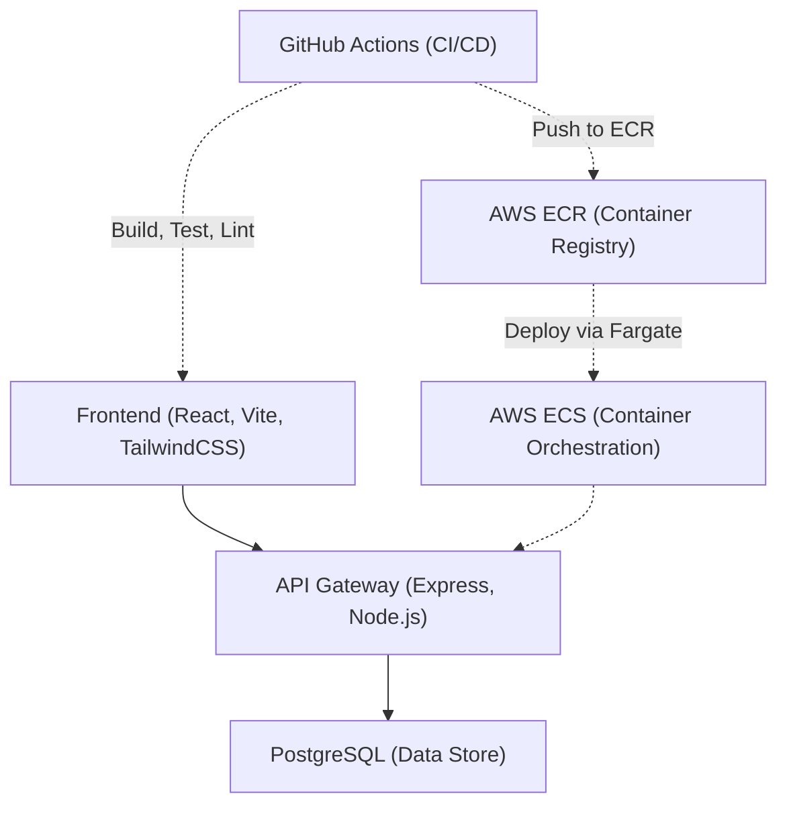
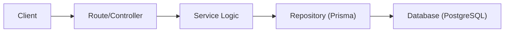
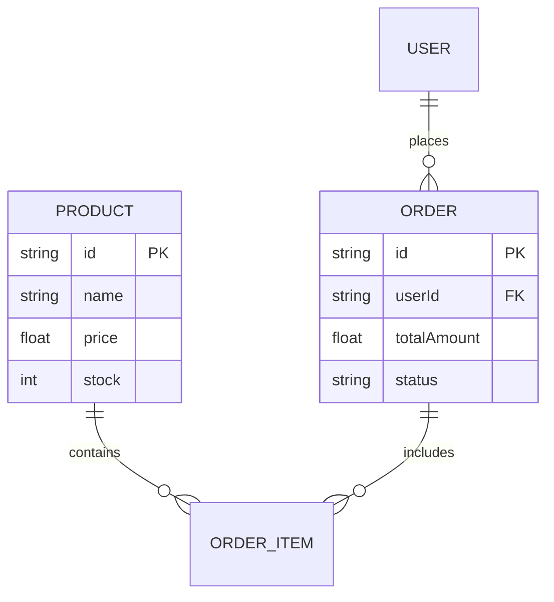

## 1. Architecture Design


## 2. Technology Description
- **Frontend**: React@18, Vite, TailwindCSS v3.
- **Backend**: Node.js, Express.js (RESTful API), PostgreSQL with Prisma ORM.
- **Testing**: Jest (Unit testing), Supertest (Integration testing), Cypress (E2E testing).
- **Linting/Formatting**: ESLint, Prettier, Husky for pre-commit hooks.
- **DevOps**: Docker, GitHub Actions (CI/CD workflows), Dependabot, AWS ECR, AWS ECS (Fargate).
- **Monitoring (Bonus)**: AWS CloudWatch for logs.

## 3. Route Definitions
| Route | Purpose |
|-------|---------|
| `/` | Home page showcasing featured items |
| `/products/:id` | Detailed product view |
| `/cart` | Interactive shopping cart |
| `/checkout` | Secure checkout process |
| `/api/products` | REST endpoint for product catalog |
| `/api/orders` | REST endpoint for order processing |

## 4. API Definitions
```typescript
interface Product {
  id: string;
  name: string;
  price: number;
  description: string;
  imageUrl: string;
  stock: number;
}

interface OrderRequest {
  items: Array<{ productId: string; quantity: number }>;
  shippingAddress: string;
  paymentToken: string;
}
```

## 5. Server Architecture Diagram


## 6. DevOps & Infrastructure Pipeline
### 6.1 GitHub Workflows
- **Pull Request Checks**: Runs `.github/workflows/ci.yml`. Installs dependencies, runs ESLint + Prettier, runs Jest/Mocha Unit Tests and Integration Tests. Fails PR if any step fails.
- **Deployment**: Runs `.github/workflows/deploy.yml` on push to `main`. Builds Docker image, authenticates with AWS via OIDC, tags and pushes image to Amazon ECR, updates ECS Task Definition, and redeploys ECS Service.
- **Dependabot**: Uses `.github/dependabot.yml` to automatically scan and update dependencies.
- **Idempotent Scripts**: Infrastructure automation and setup scripts utilize flags like `mkdir -p` or `docker network create || true`.

### 6.2 Data Model Definition

