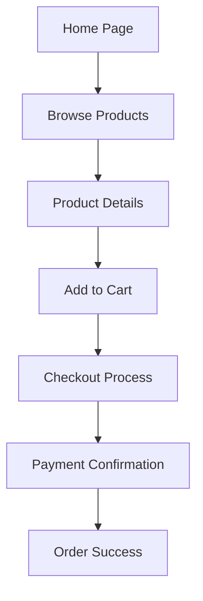

## 1. Product Overview
A "100/10 heavyweight" full-stack e-commerce application designed with a visually striking, high-end UI and production-ready architecture.
- Built to handle end-to-end e-commerce workflows (browsing, cart, checkout) with robust backend API integration.
- Demonstrates advanced engineering practices including rigorous testing (Unit, Integration, E2E), CI/CD pipelines, Dependabot, and automated AWS ECR + ECS deployments.

## 2. Core Features

### 2.1 User Roles
| Role | Registration Method | Core Permissions |
|------|---------------------|------------------|
| Customer | Email / OAuth | Browse products, manage cart, place orders, view history |
| Admin | Pre-configured | Manage inventory, view orders, platform analytics |

### 2.2 Feature Module
1. **Home Page**: Hero section with striking visuals, featured products, category navigation.
2. **Product Details**: High-quality image gallery, detailed descriptions, add to cart, related items.
3. **Cart & Checkout**: Interactive cart drawer, multi-step secure checkout, order summary.
4. **User Dashboard**: Order history, profile settings.

### 2.3 Page Details
| Page Name | Module Name | Feature description |
|-----------|-------------|---------------------|
| Home page | Hero section | High-impact typography, auto-rotating featured products, modern layout. |
| Product Details | Gallery & Info | Interactive 3D/HD product viewer, variant selection, rich text description. |
| Cart | Cart Drawer | Slide-out cart with real-time total calculation and item management. |
| Checkout | Payment Flow | Clean, responsive form for shipping and payment details with robust validation. |

## 3. Core Process
The user browses the landing page, selects a product, views details, adds it to the cart, and proceeds through a secure checkout process.

## 4. User Interface Design
### 4.1 Design Style
- **Aesthetic**: Modern, high-end luxury e-commerce (minimalist yet bold).
- **Colors**: Deep monochromatic base (Onyx black, crisp white) with a vibrant, unexpected accent color (e.g., Electric Blue or Neon Citrus) to draw attention to CTAs.
- **Typography**: Striking display fonts for headings (e.g., 'Clash Display' or 'Playfair Display') paired with highly readable sans-serif for body text (e.g., 'Satoshi').
- **Layout**: Asymmetrical grids, generous negative space, large imagery, and sticky navigation elements.
- **Motion**: Smooth page transitions, subtle parallax scrolling on the hero section, hover micro-interactions on product cards, and a satisfying add-to-cart animation.

### 4.2 Page Design Overview
| Page Name | Module Name | UI Elements |
|-----------|-------------|-------------|
| Home page | Hero section | Full-bleed background imagery, large typography, overlapping layout, staggered reveal animation. |
| Product Details | Product Info | Split-screen layout (sticky info on one side, scrolling gallery on the other). |
| Cart | Drawer | Blur backdrop, smooth slide-in, clear hierarchy of costs. |

### 4.3 Responsiveness
Desktop-first design approach with meticulous mobile adaptation. Touch-optimized carousels, bottom-sheet style menus on mobile, and readable typography at all viewport sizes.
